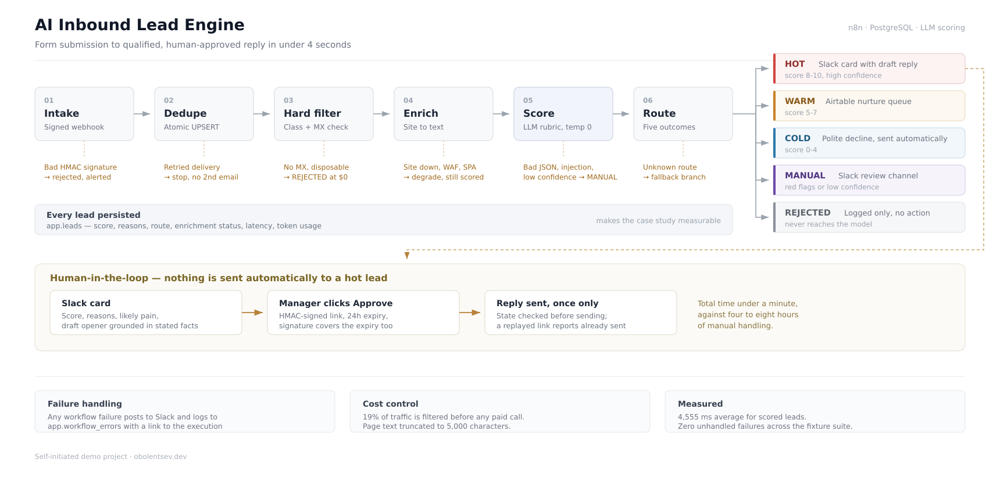

# AI Inbound Lead Engine

**Self-initiated demo project.** Routes inbound form submissions in seconds instead of the 4–8 hours a human takes.

[→ 90-second walkthrough](https://youtu.be/_li9CSW7LCM)

---

## Problem

A B2B company receives demo requests through a web form. An SDR reads each one manually, looks up the company, decides whether it is worth a call, and writes a reply. Response time is four to eight hours. By then the prospect has already talked to a competitor.

The work itself is mechanical: check the address is real, find out what the company does, decide if they fit the ideal customer profile, draft a relevant first line. Only the final judgement call needs a person.

## What it does

- Accepts form submissions over an HMAC-signed webhook and normalises any provider's payload into one schema
- Rejects duplicate deliveries atomically — a retried webhook never produces a second email
- Filters invalid, disposable, and non-deliverable addresses **before** any paid API call
- Pulls and cleans text from the company's website, with graceful degradation when the site is down, blocked, or JavaScript-only
- Scores the lead 0–10 against a configurable ICP rubric, with stated reasons
- Routes to one of five outcomes: Slack card, nurture queue, polite decline, human review, or silent filter
- Drafts a personalised opener grounded only in what the submitter actually wrote
- Sends nothing automatically: a human reviews the draft and approves it behind a signed, expiring link

## Architecture



```
Form ──► Verify & dedupe ──► Hard filter ──► Enrich ──► Score ──► Route ──► Confirm ──► Send
            │                     │             │          │         │          │
        duplicates            no MX /       site down    model    HOT / WARM /  human
          stop               disposable    → degrade    failure   COLD / MANUAL  approves
                                                        → MANUAL
```

Four workflows:

| File | Role |
|---|---|
| `workflows/lead-intake.json` | Main pipeline — intake, filtering, enrichment, scoring, routing |
| `workflows/approval-page.json` | GET confirmation page showing the draft before it is sent |
| `workflows/lead-approval-handler.json` | POST endpoint that actually sends the reply |
| `workflows/global-error-handler.json` | Catches failures across all workflows |

## Stack

n8n (self-hosted, Docker) · PostgreSQL · Caddy (automatic TLS) · OpenAI · Slack · Airtable · SMTP · Cloudflare DNS-over-HTTPS for MX validation

## Edge cases handled

This is the part that took the time.

| Case | Behaviour |
|---|---|
| Duplicate webhook delivery | Atomic `INSERT ... ON CONFLICT DO NOTHING RETURNING`. Not check-then-insert — two simultaneous retries would both pass a check |
| Forged webhook signature | HMAC-SHA256 verified against the raw request body, constant-time comparison |
| Free-mail address | Enrichment skipped — no point scraping gmail.com as "the lead's company site" |
| Disposable or malformed address | Rejected before the model is called |
| Non-existent domain | MX lookup over DNS-over-HTTPS catches typos that pass syntax validation |
| DNS lookup fails | Treated as unknown, not as rejection — an outage on our side is not the lead's fault |
| Company site down, 500, or bad TLS | Enrichment degrades to form-only; the lead is still scored |
| Cloudflare / WAF blocking | Browser User-Agent; a block is non-fatal |
| JavaScript-only site | Detected as `thin`; the model is instructed not to invent facts |
| Oversized page | Truncated to 5,000 characters — a corporate homepage can otherwise cost 10,000 tokens |
| HTTP nodes replacing item context | Every external call restores the lead payload from the prior node; without this the lead's own fields are silently lost |
| Retry duplication | Node-level retries can emit several items into an error branch; deduplicated before the model is called and before the database write |
| Prompt injection in submitted text | Untrusted input is delimited and declared as data; explicit attempts to override instructions are flagged and routed to a human |
| False positives on injection detection | The flag is bound to the *form* of the text — attempts to redefine the model's role — not to content the model dislikes. A reseller pitch is a low score, not an attack |
| Model reciting the lead's own marketing copy | The opener must reference what the submitter wrote, never describe their company back to them. Enforced with explicit good/bad examples in the prompt |
| Malformed model output | Parsed with fallback across several response shapes, including nested `output[].content[].text`; unparseable output routes to human review instead of failing the run |
| Low model confidence | Routed to a human — except for clear non-fits, where confidence is irrelevant and the lead is closed automatically |
| Role-based inbox (`info@`, `sales@`) | Routing score capped below the HOT threshold. No identifiable person behind the address, so no auto-drafted personal reply. The model's real score is still recorded |
| **Link previewers pre-fetching URLs** | Slack, Outlook Safe Links, and security scanners issue GET requests to any posted link. State-changing actions are POST-only behind a confirmation page, so a crawler following the link changes nothing |
| Approval link replayed | State checked before sending; a second click reports "already sent" |
| Approval link tampered | Signature covers both the submission ID and the expiry, so neither can be changed independently |
| Every workflow failure | Global error handler posts to Slack and logs to Postgres with a link to the execution |

## Results

Measured over the fixture suite in `tests/fixtures.sh`:

| Metric | Value |
|---|---|
| Traffic filtered before any paid API call | **19%** |
| Average processing time, scored leads | **4,555 ms** |
| Duplicate submissions reaching the pipeline | 0 |
| Unhandled failures across the suite | 0 |

Score reproducibility: identical submissions that state concrete facts produce identical scores across runs at temperature 0.

## Cost model

Roughly $0.0017 per lead at ~2,500 input / 300 output tokens.

At 3,000 leads/month: ~$5.1 in API calls plus €5.50/month for the VPS. The hard filter removes 19% of traffic before the model is called, so real cost tracks qualified volume rather than total.

## Known limitations

Stated plainly, because they matter for anyone deploying this.

- **Scoring drifts on borderline submissions.** Enquiries that state no volume, no named process, and no explicit pain can vary by several points between runs even at temperature 0. The rubric anchors on stated facts; when there are none, there is little to anchor to. Submissions with concrete details score consistently.
- **No headless browser**, so JavaScript-only sites yield thin enrichment. Production use would add a rendering service.
- **The disposable-domain list is a short static set.** Production should use a dedicated email validation API — the real list runs to tens of thousands of domains and changes daily.
- **Retry intervals are fixed, not exponential.** This is n8n's built-in behaviour; true backoff needs a counter and a wait loop.
- **Sending is via SMTP sandbox in this demo.** Production requires sending from the client's own domain with SPF, DKIM, and DMARC configured, or automated mail lands in spam.
- **Lead data is stored in plain columns.** A production deployment handling EU personal data needs a retention policy and a deletion path.

## Setup

```bash
git clone <repo>
cd ai-lead-engine

cp .env.example .env
# fill in — generate each secret with `openssl rand -hex 32`

docker compose up -d
docker compose exec -T postgres psql -U n8n -d n8n < schema.sql
```

Then in the n8n UI:

1. Create credentials: Postgres, OpenAI, Slack, SMTP, Airtable
2. Import the four workflows from `workflows/`
3. Set `Global Error Handler` as the error workflow in each workflow's settings — n8n does not assign it globally
4. Publish all four
5. Point your form's webhook at `https://your-host/webhook/lead-intake`

## Testing

```bash
./tests/fixtures.sh https://your-host/webhook/lead-intake
```

Ten scenarios covering the edge cases above. Expected outcome: nine rows in `app.leads` — the tenth is a duplicate and must not appear — exactly one lead flagged for injection, and an empty `app.workflow_errors`.

```sql
SELECT submission_id, email_class, enrichment_status, icp_score, route
FROM app.leads ORDER BY submission_id;
```

Two helper scripts reproduce the demo scenarios individually:

```bash
./scripts/demo-injection.sh   # posts a prompt-injection submission
./scripts/demo-metrics.sh     # prints the route distribution
```

## Configuration

The ideal customer profile lives in a single node (`ICP Config`) as plain text. Changing qualification criteria does not require touching prompts or code.

Routing thresholds are in `Validate LLM Output`:

```js
const ROLE_CAP = 7;
const capped = base.email_class === 'role' ? Math.min(score, ROLE_CAP) : score;

if (flags.length > 0)                 route = 'MANUAL';   // attack or serious signal
else if (capped <= 2)                 route = 'COLD';     // clear non-fit, confidence irrelevant
else if (parsed.confidence === 'low') route = 'MANUAL';   // ambiguous, send to a person
else if (capped >= 8)                 route = 'HOT';
else if (capped >= 5)                 route = 'WARM';
else                                  route = 'COLD';
```

The order matters. Checking for a clear non-fit before checking confidence keeps obvious rejections off a human's desk.
